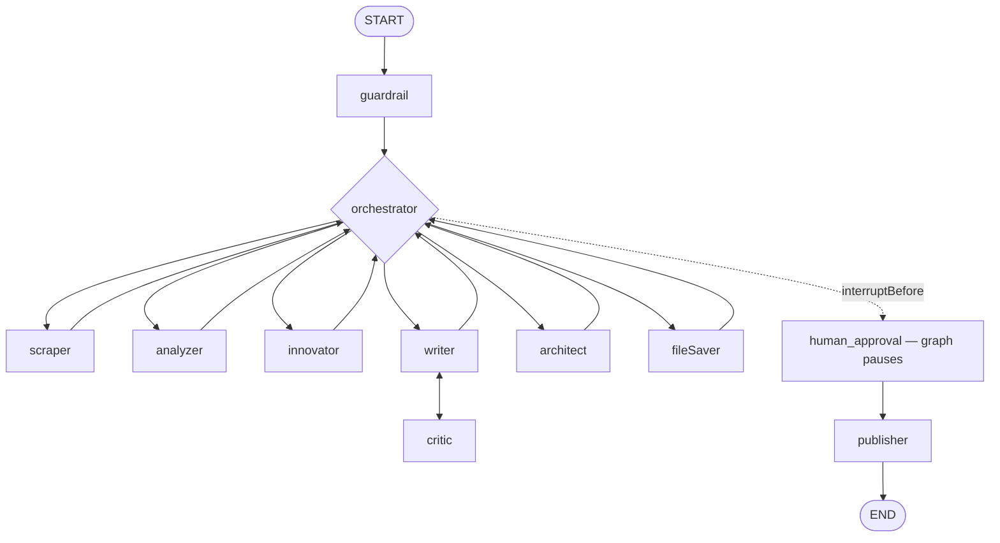

# AI Orchestra (Agent-Matrix)


> A multi-tenant, multi-agent AI platform that operates as a complete autonomous digital company — research, analysis, writing, review, publishing, invoice auditing, supply-chain monitoring and social autopilot — with a human always in the loop.

Two halves:

- **The Brain** — Node.js + Express + LangGraph running a 16-agent swarm.
- **The Command Center** — a Next.js 14 "Cyber-Nexus" dashboard where an operator watches agents work live and authorizes or rejects their output.

---

## Table of Contents

- [Quick Start](#quick-start)
- [Environment Variables](#environment-variables)
- [Repository Layout](#repository-layout)
- [Architecture](#architecture)
- [Agents](#agents)
- [Routing Tracks (FREN System)](#routing-tracks-fren-system)
- [Products & Plans](#products--plans)
- [Security (MOAT)](#security-moat)
- [API Surface](#api-surface)
- [Real-time (SSE)](#real-time-sse)
- [n8n Integration](#n8n-integration)
- [Testing](#testing)
- [Gotchas](#gotchas)

---

## Quick Start

Requires **Node.js 18+** and a **MongoDB Atlas** cluster.

### 1. Backend

```bash
cd server
cp .env.example .env      # fill in the keys listed below
npm install
node src/index.js         # http://localhost:3000
```

There is no `start` script — the server is launched directly with `node src/index.js`.

### 2. Create the admin account (one time)

```bash
cd server
node scripts/create-admin.js
```

This bootstraps an account with `isAdmin: true`, which unlocks the `/api/admin/*` routes and makes the **GOD MODE** button appear in the dashboard sidebar.

### 3. Frontend

```bash
cd frontend
npm install
npm run dev               # http://localhost:3002
```

The backend must already be listening on port `3000`; the dashboard connects to it over REST + SSE.

```bash
npm run build             # production build
npm run lint              # ESLint
```

---

## Environment Variables

Backend keys live in `server/.env` (start from `server/.env.example`).

| Variable | Required | Purpose |
|----------|:--------:|---------|
| `MONGODB` | yes | MongoDB Atlas connection string |
| `ANTHROPIC_API_KEY` | yes | Claude models via `@langchain/anthropic` |
| `TAVILY_API_KEY` | yes | Web search for the Scraper agent |
| `GEMINI_API_KEY` | yes | Vector embeddings (`gemini-embedding-001`, 1536-dim) |
| `PORT` | — | Backend port, defaults to `3000` |
| `TELEGRAM_BOT_TOKEN` | — | Two-way Telegram bot + HITL notifications |
| `TELEGRAM_CHAT_ID` | — | Default Telegram notification target |
| `DISCORD_WEBHOOK_URL` | — | Discord notifications |
| `TWILIO_SID` / `TWILIO_TOKEN` | — | WhatsApp via Twilio |
| `GOOGLE_CLIENT_ID` / `GOOGLE_CLIENT_SECRET` | — | Gmail OAuth2 |
| `N8N_PUBLISH_WEBHOOK` | — | Outbound social publishing webhook |
| `N8N_WEBHOOK_SECRET` | — | Shared secret for inbound n8n requests (`X-Webhook-Secret`) |

Never commit real secrets. Only `NEXT_PUBLIC_`-prefixed variables are readable from the browser bundle.

---

## Repository Layout

```
Agent-Matrix/
├── server/                        # Node.js + Express + LangGraph (ES Modules)
│   ├── src/
│   │   ├── index.js               # Express + MongoDB + cron + Telegram startup
│   │   ├── agents/                # 16 agent node functions
│   │   ├── workflows/
│   │   │   ├── graph.js           # StateGraph: nodes + edges
│   │   │   └── runner.js          # Workflow runners, SSE buses, snapshot emitter
│   │   ├── state/graphState.js    # Zod LangGraph state schema
│   │   ├── controllers/           # 18 route controllers
│   │   ├── routes/                # 18 route modules, all mounted under /api
│   │   ├── models/                # 16 Mongoose schemas
│   │   ├── services/              # 11 utility services
│   │   ├── middleware/            # tenant, rateLimiter, admin, webhook
│   │   ├── config/plans.js        # SaaS plans + product/sub-tab definitions
│   │   ├── skills/index.js        # Dynamic per-tenant agent tools
│   │   └── tools/scraperTool.js   # Tavily integration
│   ├── scripts/create-admin.js    # Admin bootstrap
│   └── tests/                     # Vitest suite
├── frontend/                      # Next.js 14 App Router (TypeScript)
│   └── src/
│       ├── app/page.tsx           # Sidebar + main view + right panel
│       ├── components/            # Feature-organized components (incl. admin/)
│       └── store/
│           ├── agent-store.ts     # Zustand — single source of truth
│           ├── slices/            # authSlice, adminSlice
│           └── types.ts           # Shared TypeScript types
└── n8n-workflows/                 # 7 production n8n workflow JSONs
```

**ES Modules everywhere on the server** — `server/package.json` sets `"type": "module"`, so `require()` throws. Use `import`/`export`.

---

## Architecture

### LangGraph workflow — hub-and-spoke with a MOAT guard



Every routing decision lives in `orchestratorNode`, which sets `state.nextAgent`. The graph is compiled with `interruptBefore: ["human_approval"]`, so it halts before publishing; `POST /api/approve` resumes the thread. After approval, `runPublishWorkflow` calls `publisherNode` directly.

### Dual engine

- **Reactive** — an incoming message is triaged by `customerBotAgent`, then handed to a workflow.
- **Proactive** — `cronService.js` fires an `INNOVATION_RADAR` run nightly at 23:00 with no human trigger.

### Human-in-the-loop

1. `fileSaver` persists the artifact and sets `state.fileSaved = true`.
2. The graph pauses at `human_approval`.
3. `runner.js` emits a `workflow_complete` SSE event carrying the report.
4. The dashboard opens the right panel; the operator hits **Authorize** or **Override**.
5. `POST /api/approve` resumes the paused thread.

Report content reaches the UI two ways: live from the SSE event into the Zustand store, and — after a reload or state reset — by fetching `GET /api/artifact/:threadId`.

### Models

16 Mongoose collections. The load-bearing ones:

| Model | Purpose |
|-------|---------|
| `Client` | Tenant registry — plan, product, API key, `isAdmin` |
| `Report` | Main artifact, keyed by unique `threadId` |
| `TenantConfig` | Per-tenant overrides: throttle switch, persona, `socialAuto` config |
| `Knowledge` | RAG vector store, 1536-dim embeddings |
| `ActionQueue` | MOAT layer 4 — agents enqueue, the worker executes |
| `SecurityEvent` | Guardrail audit log (7-day TTL) |
| `WorkflowSnapshot` | Per-node state snapshots powering the Time Machine (7-day TTL) |
| `Transaction` | LLM token to USD cost tracking |
| `SystemPrompt` | Per-tenant custom prompts, unique on `(agentName, clientId)` |
| `Feedback` | Up/down votes fed back into the Writer's prompt |

Others: `BannedIP`, `CampaignDraft`, `ScheduledPost`, `Skill`, `SocialAccount`, `SupportTicket`.

---

## Agents

| Node | Responsibility |
|------|---------------|
| `guardrail` | Threat scoring, prompt-injection blocking, input sanitization |
| `orchestrator` | Hub router — deterministic FREN guards first, then LLM structured output |
| `scraper` | Tavily web search, source sanitization |
| `analyzer` | Strategic three-point analysis; supports custom prompts |
| `innovator` | Devil's advocate — the contrarian "fourth path" |
| `writer` | Markdown reports and social copy; custom prompts + negative-feedback injection |
| `critic` | QA loop, capped at 5 revisions before the circuit breaker forces approval |
| `architect` | Technical blueprints: system design, API specs, infrastructure |
| `fileSaver` | Upserts the `Report` document by `threadId` |
| `human_approval` | Placeholder node — the HITL interrupt point |
| `publisher` | Enqueues outbound actions (Telegram, Discord, webhooks, social) |
| `auditor` | Invoice analysis and anomaly flagging |
| `supplyChain` | Stock monitoring and supplier order drafting |
| `salesRep` | B2B negotiation, up to 3 rounds |
| `cmoAgent` *(async)* | Multi-channel marketing campaigns from approved reports |
| `customerBotAgent` *(async)* | Inbound message triage + RAG-backed replies |
| `socialContentAgent` *(async)* | Per-tenant social autopilot with an optional HITL gate |

### Multi-tenant social autopilot

Configured per tenant via `POST /api/tenant/config`:

```json
{
  "socialAuto": {
    "enabled": true,
    "platform": "twitter",
    "topics": ["AI trends", "SaaS growth"],
    "postCount": 3,
    "requireHITL": true,
    "integrations": {
      "telegramBotToken": "...",
      "telegramChatId": "..."
    }
  }
}
```

A daily cron iterates every tenant with `socialAuto.enabled`, generates posts per topic and platform, and stores them as `ScheduledPost` documents — `AWAITING_APPROVAL` when `requireHITL` is set, plus a Telegram notification. Approved posts flow to the action worker and out through `N8N_PUBLISH_WEBHOOK`. The Telegram token resolves tenant-first, then falls back to the global variable.

---

## Routing Tracks (FREN System)

Deterministic, pre-LLM guards inside `orchestrator.js`. They cost nothing and always run before the model is consulted.

| Task prefix | Track | Agent flow |
|-------------|-------|-----------|
| `RFP_RESPONSE` | RFP responder | writer → critic → fileSaver |
| `INNOVATION_RADAR` | Innovation radar | scraper → analyzer → innovator → writer |
| `TREND_RADAR` | Trend radar | scraper → analyzer → innovator → writer |
| `COLD_OUTREACH` | B2B outreach | scraper → writer → critic → fileSaver |
| `BUSINESS_STRESS_TEST` | Stress test | analyzer → innovator → writer → critic |
| `INVOICE_PROCESSING` | Finance audit | auditor → fileSaver |
| `STOCK_CHECK` | Supply chain | supplyChain → fileSaver |
| `HOT_LEAD_FOLLOWUP` | Sales | salesRep (3 rounds max) → fileSaver |
| `TWITTER` / `LINKEDIN` | Social media | scraper → writer → critic → fileSaver |
| *(default)* | Research | scraper → analyzer → innovator → writer → critic → fileSaver |

---

## Products & Plans

Defined in `server/src/config/plans.js`. Each tenant carries one `plan` and one `product`.

| Plan | Price | Agents unlocked | Max revisions |
|------|-------|-----------------|:-------------:|
| `free` | $99/mo | fileSaver, human_approval, publisher | 1 |
| `pro` | $299/mo | + scraper, writer, critic | 3 |
| `enterprise` | $999/mo | all agents | 5 |
| `holding` | $3,000+/mo | all agents + salesRep, auditor, supplyChain | unlimited |

Six mega-departments replaced the earlier twelve granular products. Departments with several tracks expose **sub-tabs**; the active sub-tab prepends its task prefix before dispatch, so FREN routing keeps working untouched.

| Product | Sub-tabs | Required plan |
|---------|----------|---------------|
| `cx` | — (standalone customer bot) | free |
| `growth` | Social media · Cold outreach · RFP response | pro |
| `strategy` | Competitor radar · Trend radar · Stress test | pro |
| `backoffice` | Finance audit · Stock check | enterprise |
| `engineering` | — (architect → fileSaver) | pro |
| `holding` | — (all agents) | holding |

---

## Security (MOAT)

| Layer | Where | Mechanism |
|:-----:|-------|-----------|
| 1 — Input guard | `guardrailNode` | Regex threat detection, injection blocking, sanitization |
| 2 — Rate limiting | `rateLimiter.js` | Per-tenant windows + O(1) banned-IP lookup |
| 3 — Authentication | `tenant.js` | API key validation, injects `req.clientId` |
| 4 — Action isolation | `actionWorkerService.js` + `ActionQueue` | Agents only enqueue; the worker validates schema and whitelist before any external call |

Agents never call an external API directly. The worker polls the queue every 5 seconds, checks the action type against a whitelist, and only then reaches the outside world.

---

## API Surface

Everything mounts under `/api/*`.

| Prefix | Key endpoints |
|--------|--------------|
| `/` | `GET /events/:threadId` (SSE), `POST /analyze`, `POST /rnd` |
| `/auth` | `POST /register`, `POST /login` |
| `/approve` | `POST /` — resume a paused HITL workflow |
| `/artifact` | `GET /:threadId`, `GET /list` |
| `/missions` | `GET /`, `GET /:threadId` |
| `/campaign` | `GET /list`, `POST /approve/:id` |
| `/feedback` | `POST /`, `GET /negative` |
| `/finance` | `GET /costs`, `GET /transactions` |
| `/inbox` | `GET /`, `GET /:threadId` |
| `/knowledge` | `POST /upload`, `GET /search` |
| `/prompts` | `GET /`, `PUT /:agent`, `DELETE /:agent` |
| `/security` | `GET /events`, `GET /summary` |
| `/skills` | `GET /`, `PUT /:id` |
| `/social` | `GET /accounts`, `POST /connect`, `POST /schedule` |
| `/support` | `GET /tickets`, `POST /response/:ticketId` |
| `/tenant` | `GET /config`, `POST /config` |
| `/admin` | God Mode — see below |

### God Mode (`/api/admin/*`)

Guarded by `requireAdmin`; needs `Client.isAdmin === true`.

| Method | Path | Description |
|--------|------|-------------|
| `GET` | `/tenants` | All tenants — plan, live status, monthly workflow count |
| `GET` | `/tenants/:slug` | Tenant detail + config |
| `POST` | `/tenants/:slug/suspend` · `/unsuspend` | Suspend or restore a tenant |
| `POST` | `/tenants/:slug/throttle` | Toggle the per-tenant LLM kill switch |
| `GET` | `/tenants/:slug/live` | SSE — Ghost Mode stream for one tenant |
| `GET` | `/events/global` | SSE — all-tenant event stream |
| `GET` | `/workflows/active` | In-memory active workflow map |
| `GET` | `/workflows/recent` | Aggregated recent workflows |
| `GET` | `/workflows/:threadId/snapshots` | Time Machine snapshots |
| `GET` | `/security` | Global security metrics + recent events |
| `GET` | `/logs` | Admin audit log |
| `GET` | `/finance` | Global P&L, per-tenant margins, alerts |
| `GET` | `/finance/live` | SSE — real-time cost ticks (burn rate) |
| `GET` `POST` `DELETE` | `/ips`, `/ips/ban`, `/ips/:ip` | Banned-IP management |

The dashboard exposes these as **Fleet Radar** (tenant list), **Ghost Mode** (watch a tenant's live stream), **Operating Room** + **Time Machine** (replay per-node state), **SOC Panel** (security events, IP bans) and **FinOps** (live burn rate, P&L, throttle).

---

## Real-time (SSE)

Three independent event emitters, kept separate to avoid circular imports:

```
agentEventBus   -> GET /api/events/:threadId          per-thread workflow events
systemEventBus  -> GET /api/admin/events/global       admin global stream
                -> GET /api/admin/tenants/:slug/live  ghost mode
costEventBus    -> GET /api/admin/finance/live        FinOps burn rate
```

Events emitted before the browser opens its connection are held in an `eventBuffers` map and replayed in order on connect, so nothing is lost during startup.

---

## n8n Integration

Seven production workflows in `n8n-workflows/`. n8n is a pure data pipeline — no LLM runs inside it; all classification stays in the AI Brain.

| # | Workflow | Direction | Trigger |
|---|----------|-----------|---------|
| 1 | `email-classifier-workflow.json` | inbound | Gmail trigger |
| 2 | `twitter-listener.json` | inbound | poll, 5 min |
| 3 | `instagram-listener.json` | inbound | Meta webhook, real time |
| 4 | `youtube-listener.json` | inbound | poll, 15 min |
| 5 | `tiktok-listener.json` | inbound | poll, 30 min |
| 6 | `social-media-publisher.json` | outbound | `N8N_PUBLISH_WEBHOOK` |
| 7 | `email-campaign-sender.json` | outbound | webhook |

**Inbound** — platform, then n8n normalizes, then `POST /api/inbox` with `X-Api-Key` and `X-Webhook-Secret`:

```json
{
  "platform":    "gmail|twitter|instagram|youtube|tiktok",
  "platform_id": "unique id, used for idempotency",
  "author":      "@username or display name",
  "content":     "message body, max 3000 chars"
}
```

**Outbound** — `publisherAgent` → `ActionQueue` → action worker → `N8N_PUBLISH_WEBHOOK` → platform.

Instagram publishes in two steps (create container, then `media_publish`). TikTok and YouTube have no text-only post API and return `MANUAL_REQUIRED`. Email campaigns are batched at 50 recipients with a 2-second delay.

---

## Testing

```bash
cd server
npm test              # vitest run
npm run test:watch
```

---

## Gotchas

- **Node signature** — any LangGraph node that reads `tenantConfig` or `clientId` must declare `(state, config)`. Omitting `config` throws `ReferenceError` at runtime.
- **`Report` has no `clientId`** — `fileAgent.js` does not persist it. Query `Report.exists({ threadId })`, never `{ threadId, clientId }`.
- **Revision circuit breaker** — `orchestrator.js` forces `human_approval` at `revisionCount >= 5`. Removing that guard reopens an infinite writer/critic loop.
- **Admin route order** — `/workflows/recent` must be declared before `/workflows/:threadId/snapshots`, or Express captures the literal `recent` as a `threadId`.
- **Circular-import escape hatches** — `bannedIPCacheService.js` and `costEventBus.js` are standalone modules precisely so `rateLimiter.js` and `costTracker.js` never import `adminController`.
- **Snapshot writes are fire-and-forget** — `.catch(() => {})` in `runner.js`. A snapshot DB failure must never take down a workflow.
- **SSE buffering is load-bearing** — do not remove `eventBuffers`; without it, events fired before the browser connects are lost.
- **Admin password hashing** — `create-admin.js` uses `crypto.scryptSync` to match `authController.js`. Any other algorithm silently creates an account that can never log in.
- **`isAdmin` must survive login** — `authController.login` has to return `isAdmin` in the client object, otherwise the GOD MODE button never renders.
- **Atlas vector index** — the `Knowledge` collection needs a vector search index named `vector_index`. RAG search fails silently without it.
- **Prompt cache** — `promptRepository` caches for 60s but invalidates on save and delete, so edits take effect immediately.

---

## License

ISC
